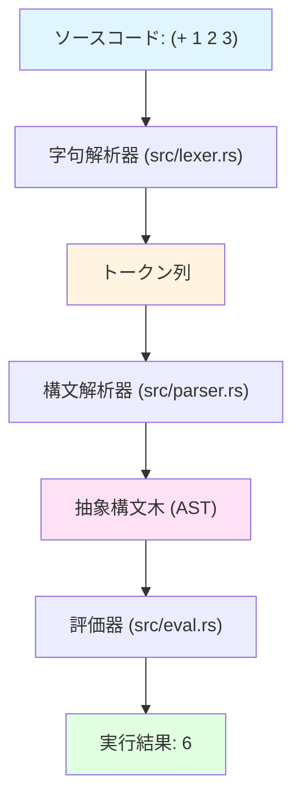

# 言語処理系の全体像

Qi言語処理系は、典型的な**インタプリタ型言語**として実装されています。ソースコードから実行結果を得るまでの流れを理解しましょう。

## 処理の流れ



## コアコンポーネント

### 1. 値の表現 (src/value.rs)

Qiで扱うすべての値は`Value` enumで表現されます：

```rust
pub enum Value {
    Nil,
    Boolean(bool),
    Integer(i64),
    Float(f64),
    String(String),
    Symbol(String),
    List(Vec<Value>),
    Vector(Vec<Value>),
    Map(HashMap<String, Value>),
    Set(HashSet<Value>),
    Function(Arc<Function>),
    NativeFunc(Arc<NativeFunction>),
    // ... その他の型
}
```

### 2. 式の表現 (src/parser.rs)

構文解析の結果は`Expr` enumで表現されます：

```rust
pub enum Expr {
    Integer(i64),
    Float(f64),
    String(String),
    Symbol(String),
    List(Vec<Expr>),
    Vector(Vec<Expr>),
    Map(Vec<(Expr, Expr)>),
    // 特殊形式
    If(Box<Expr>, Box<Expr>, Option<Box<Expr>>),
    Def(String, Box<Expr>),
    Fn { params: Vec<String>, body: Box<Expr>, is_variadic: bool },
    // ... その他
}
```

### 3. 評価器 (src/eval.rs)

`Evaluator`構造体がASTを実行します：

```rust
pub struct Evaluator {
    env: Arc<RwLock<Env>>,
}

impl Evaluator {
    pub fn eval(&self, expr: &Expr) -> Result<Value, String> {
        // Exprをパターンマッチして評価
    }
}
```

### 4. 環境 (src/eval.rs内)

変数と関数のバインディングを管理：

```rust
pub struct Env {
    bindings: HashMap<String, Value>,
    parent: Option<Arc<RwLock<Env>>>,
}
```

スコープチェーンを形成し、レキシカルスコープを実現します。

## 主要な設計決定

### ホモイコニシティ

Lispの最大の特徴は**コードとデータが同じ構造**であることです。Qiでは：

- `(+ 1 2)` はリスト構造として表現される
- マクロがこの性質を利用してコード変換を行う

### 遅延評価と正格評価

Qiは基本的に**正格評価**（引数を先に評価）ですが：

- マクロは引数を評価せずに受け取る
- 特殊形式（`if`, `def`など）も引数を制御して評価

### 並行処理

Qiは並行処理を第一級としています：

- `Arc<RwLock<T>>`で環境を共有
- スレッドセーフな値の管理

## 次のステップ

各コンポーネントの詳細を順番に学んでいきましょう：

- [字句解析](./02-lexer.md) - ソースコードをトークンに分割
- [構文解析](./03-parser.md) - トークンからASTを構築
- [評価器](./04-evaluator.md) - ASTを実行
- [環境とスコープ](./05-environment.md) - 変数管理
- [ビルトイン関数](./06-builtins.md) - ネイティブ関数の実装
