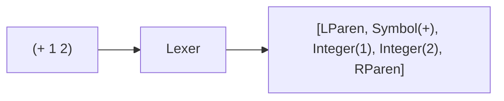

# 字句解析 (Lexical Analysis)

字句解析器（Lexer）は、ソースコードの文字列を**トークン列**に変換します。これは言語処理系の最初のステップです。

📁 実装: `src/lexer.rs`

## 処理の流れ



## Lexer構造体

```rust
pub struct Lexer {
    input: Vec<char>,  // 入力文字列（文字の配列）
    pos: usize,        // 現在位置
    line: usize,       // 現在の行番号
    column: usize,     // 現在の列番号
}
```

**設計のポイント:**
- 入力を`Vec<char>`として保持 → Unicode文字を正しく扱える
- `line`と`column`を追跡 → エラー時に正確な位置を報告
- `pos`で現在位置を管理 → `current()`と`peek()`で先読み

## Token列挙型

```mermaid
graph TD
    Token[Token] --> Lit[リテラル]
    Token --> Paren[括弧]
    Token --> Other[その他]

    Lit --> Integer
    Lit --> Float
    Lit --> String
    Lit --> FString["FString (f-string補間)"]
    Lit --> Symbol
    Lit --> Keyword
    Lit --> Nil/True/False

    Paren --> LParen["( ) [ ] { }"]

    Other --> Quote["'クォート"]
    Other --> Backquote["`バッククォート"]
    Other --> Pipe["|> パイプ"]
    Other --> Arrow["-> 矢印"]
```

### トークンの種類

```rust
pub enum Token {
    // リテラル
    Integer(i64),              // 123, -456
    Float(f64),                // 3.14, -2.5
    String(String),            // "hello"
    FString(Vec<FStringPart>), // f"hello {name}"
    Symbol(String),            // foo, +, map
    Keyword(String),           // :name, :age
    True, False, Nil,          // 特殊な値

    // 括弧
    LParen, RParen,            // ( )
    LBracket, RBracket,        // [ ]
    LBrace, RBrace,            // { }

    // その他
    Quote,                     // '
    Backquote,                 // `
    Unquote,                   // ,
    UnquoteSplice,             // ,@
    Pipe,                      // |>
    PipeRailway,               // |>?
    ParallelPipe,              // ||>
    AsyncPipe,                 // ~>
    Arrow,                     // ->
    FatArrow,                  // =>
    Ellipsis,                  // ...

    Eof,                       // ファイル終端
}
```

## 字句解析の手順

```mermaid
flowchart TD
    Start([next_token開始]) --> Skip[空白・コメントをスキップ]
    Skip --> Check{現在文字は?}

    Check -->|"(, ), [, ], {, }"| Paren[括弧トークン返却]
    Check -->|"数字"| Num[read_number]
    Check -->|"\""| Str[read_string]
    Check -->|f"| FStr[read_fstring]
    Check -->|:| Kwd[read_keyword]
    Check -->|文字| Sym[read_symbol]
    Check -->|特殊文字| Special[演算子・記号]
    Check -->|EOF| End([Eof返却])

    Num --> Return([トークン返却])
    Str --> Return
    FStr --> Return
    Kwd --> Return
    Sym --> Return
    Special --> Return
    Paren --> Return
```

## 主要なメソッド

### 1. 文字の読み取り

```rust
fn current(&self) -> Option<char> {
    if self.pos < self.input.len() {
        Some(self.input[self.pos])
    } else {
        None
    }
}

fn peek(&self, offset: usize) -> Option<char> {
    let pos = self.pos + offset;
    if pos < self.input.len() {
        Some(self.input[pos])
    } else {
        None
    }
}

fn advance(&mut self) {
    if let Some(ch) = self.current() {
        if ch == '\n' {
            self.line += 1;
            self.column = 1;
        } else {
            self.column += 1;
        }
    }
    self.pos += 1;
}
```

**ポイント:**
- `current()`: 現在位置の文字を取得（消費しない）
- `peek(n)`: n文字先を見る（先読み）
- `advance()`: 位置を進める + 行列番号を更新

### 2. 数値の読み取り

```rust
fn read_number(&mut self) -> Token {
    let mut num_str = String::new();
    let mut is_float = false;

    // 負号の処理
    if self.current() == Some('-') {
        num_str.push('-');
        self.advance();
    }

    while let Some(ch) = self.current() {
        if ch.is_numeric() {
            num_str.push(ch);
            self.advance();
        } else if ch == '.' && !is_float {
            is_float = true;    // 小数点を検出
            num_str.push(ch);
            self.advance();
        } else {
            break;              // 数字以外で終了
        }
    }

    if is_float {
        Token::Float(num_str.parse().unwrap())
    } else {
        Token::Integer(num_str.parse().unwrap())
    }
}
```

**処理:**
1. 負号をチェック
2. 数字を読み続ける
3. `.`が出たら浮動小数点数とマーク
4. 整数か浮動小数点数のトークンを返す

### 3. 文字列の読み取り

```rust
fn read_string(&mut self) -> Result<String, String> {
    self.advance(); // 先頭の "
    let mut result = String::new();

    while let Some(ch) = self.current() {
        if ch == '"' {
            self.advance();
            return Ok(result);  // 終了
        } else if ch == '\\' {
            // エスケープシーケンス
            self.advance();
            match self.current() {
                Some('n') => result.push('\n'),
                Some('t') => result.push('\t'),
                Some('r') => result.push('\r'),
                Some('\\') => result.push('\\'),
                Some('"') => result.push('"'),
                Some(c) => result.push(c),
                None => return Err("Unclosed string".to_string()),
            }
            self.advance();
        } else {
            result.push(ch);
            self.advance();
        }
    }

    Err("Unclosed string".to_string())
}
```

**エスケープシーケンス:**
- `\n` → 改行
- `\t` → タブ
- `\r` → キャリッジリターン
- `\\` → バックスラッシュ
- `\"` → ダブルクォート

### 4. F-string（文字列補間）

Qiは`f"hello {name}"`のような文字列補間をサポートします：

```rust
pub enum FStringPart {
    Text(String),   // 通常のテキスト
    Code(String),   // {}内のコード
}

fn read_fstring(&mut self) -> Result<Vec<FStringPart>, String> {
    self.advance(); // f
    self.advance(); // "
    let mut parts = Vec::new();
    let mut current_text = String::new();

    while let Some(ch) = self.current() {
        if ch == '"' {
            // 残ったテキストを追加
            if !current_text.is_empty() {
                parts.push(FStringPart::Text(current_text));
            }
            self.advance();
            return Ok(parts);
        } else if ch == '{' {
            // {}内のコードを読み取る
            if !current_text.is_empty() {
                parts.push(FStringPart::Text(current_text.clone()));
                current_text.clear();
            }
            self.advance(); // {
            let mut code = String::new();
            let mut depth = 1;  // ネストしたブレースを追跡
            // ... コード読み取り ...
            parts.push(FStringPart::Code(code));
        } else {
            current_text.push(ch);
            self.advance();
        }
    }

    Err("Unclosed f-string".to_string())
}
```

**例:**
```lisp
f"Hello, {name}! You are {age} years old."
```

↓

```rust
[
    FStringPart::Text("Hello, "),
    FStringPart::Code("name"),
    FStringPart::Text("! You are "),
    FStringPart::Code("age"),
    FStringPart::Text(" years old."),
]
```

## 複数行文字列

Qiは`""" ... """`で複数行文字列をサポート：

```lisp
"""
This is a
multi-line
string
"""
```

`read_multiline_string()`が`"""`を検出して終端まで読み取ります。

## コメント

`;`から行末までがコメント：

```lisp
(+ 1 2) ; これはコメント
```

```rust
fn skip_comment(&mut self) {
    if self.current() == Some(';') {
        while let Some(ch) = self.current() {
            self.advance();
            if ch == '\n' {
                break;
            }
        }
    }
}
```

## 学びのポイント

1. **先読み (Lookahead)**
   - `peek()`で複数文字の演算子を判定（`|>`、`||>`など）
   - 文脈に応じた解釈（`-`は負号か演算子か）

2. **状態管理**
   - 行番号・列番号の追跡 → エラー報告
   - ネストしたブレースの深さ追跡 → f-string

3. **エラーハンドリング**
   - 閉じられていない文字列
   - 予期しない文字

これらは一般的な字句解析器で共通の技法です。

## 次のステップ

トークン列が得られたら、次は[構文解析](./03-parser.md)でASTを構築します。
