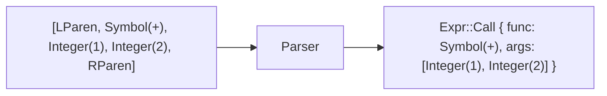
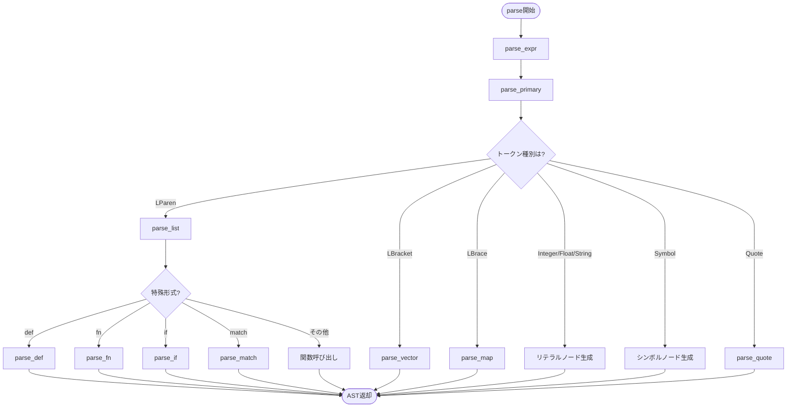

# 構文解析 (Parsing)

構文解析器（Parser）は、**トークン列を抽象構文木（AST）**に変換します。これは言語処理系の第2ステップです。

📁 実装: `src/parser.rs`

## 処理の流れ



## Parser構造体

```rust
pub struct Parser {
    tokens: Vec<Token>,  // トークン列
    pos: usize,          // 現在位置
}
```

**設計のポイント:**
- トークン列を一度に保持（Lexerで生成済み）
- `pos`で現在位置を管理
- `current()`で現在のトークンを参照（消費しない）
- `advance()`で位置を進める

## 抽象構文木（AST）

ASTは`Expr` enumで表現されます：

```rust
pub enum Expr {
    // リテラル
    Nil,
    Bool(bool),
    Integer(i64),
    Float(f64),
    String(String),
    FString(Vec<FStringPart>),
    Symbol(String),
    Keyword(String),

    // データ構造
    List(Vec<Expr>),
    Vector(Vec<Expr>),
    Map(Vec<(Expr, Expr)>),

    // 特殊形式
    Def(String, Box<Expr>),
    Fn { params: Vec<String>, body: Box<Expr>, is_variadic: bool },
    Let { bindings: Vec<(String, Expr)>, body: Box<Expr> },
    If { test: Box<Expr>, then: Box<Expr>, otherwise: Option<Box<Expr>> },
    Do(Vec<Expr>),
    Match { expr: Box<Expr>, arms: Vec<MatchArm> },

    // 関数呼び出し
    Call { func: Box<Expr>, args: Vec<Expr> },

    // その他
    Loop { bindings: Vec<(String, Expr)>, body: Box<Expr> },
    Recur(Vec<Expr>),
    Mac { name: String, params: Vec<String>, is_variadic: bool, body: Box<Expr> },
    Try(Box<Expr>),
    Defer(Box<Expr>),
    Module(String),
    Export(Vec<String>),
    Use { module: String, mode: UseMode },
    // ...
}
```

## 構文解析の階層構造



## 主要なメソッド

### 1. トークンの読み取り

```rust
fn current(&self) -> Option<&Token> {
    if self.pos < self.tokens.len() {
        Some(&self.tokens[self.pos])
    } else {
        None
    }
}

fn advance(&mut self) {
    self.pos += 1;
}

fn expect(&mut self, expected: Token) -> Result<(), String> {
    match self.current() {
        Some(token) if token == &expected => {
            self.advance();
            Ok(())
        }
        Some(token) => Err(format!("Expected {:?}, got {:?}", expected, token)),
        None => Err(format!("Expected {:?}, got EOF", expected)),
    }
}
```

**ポイント:**
- `current()`: 現在のトークンを取得（消費しない）
- `advance()`: 位置を進める
- `expect()`: 期待するトークンをチェックして消費

### 2. 式の解析

```rust
fn parse_expr(&mut self) -> Result<Expr, String> {
    let mut expr = self.parse_primary()?;

    // パイプライン演算子を処理
    loop {
        match self.current() {
            Some(Token::Pipe) => {
                self.advance();
                let right = self.parse_primary()?;

                // x |> f を (f x) に変換
                expr = Expr::Call {
                    func: Box::new(right),
                    args: vec![expr],
                };
            }
            _ => break,
        }
    }

    Ok(expr)
}
```

**`parse_expr`の役割:**
- 基本式をパース (`parse_primary`)
- パイプライン演算子を処理
- 中置演算子の糖衣構文を展開

### 3. 基本式の解析

```rust
fn parse_primary(&mut self) -> Result<Expr, String> {
    match self.current() {
        Some(Token::Integer(n)) => {
            let n = *n;
            self.advance();
            Ok(Expr::Integer(n))
        }
        Some(Token::Symbol(s)) => {
            let s = s.clone();
            self.advance();
            Ok(Expr::Symbol(s))
        }
        Some(Token::LParen) => self.parse_list(),
        Some(Token::LBracket) => self.parse_vector(),
        Some(Token::LBrace) => self.parse_map(),
        // ...
    }
}
```

**`parse_primary`の役割:**
- リテラル → 直接ASTノードに変換
- `(` → リスト/関数呼び出し/特殊形式をパース
- `[` → ベクタをパース
- `{` → マップをパース

## 特殊形式の解析

### 1. リストと関数呼び出し

```mermaid
flowchart TD
    LParen["`(` 検出"] --> Empty{空リスト?}
    Empty -->|Yes| EmptyList["Expr::List([])"]
    Empty -->|No| CheckFirst[先頭シンボルチェック]

    CheckFirst --> IsSpecial{特殊形式?}
    IsSpecial -->|def| ParseDef["parse_def()"]
    IsSpecial -->|fn| ParseFn["parse_fn()"]
    IsSpecial -->|if| ParseIf["parse_if()"]
    IsSpecial -->|match| ParseMatch["parse_match()"]
    IsSpecial -->|No| ParseCall[関数呼び出しとしてパース]

    ParseCall --> Func[関数式をパース]
    Func --> Args[引数をパース]
    Args --> CallNode["Expr::Call { func, args }"]
```

**実装:**

```rust
fn parse_list(&mut self) -> Result<Expr, String> {
    self.expect(Token::LParen)?;

    // 空リスト
    if self.current() == Some(&Token::RParen) {
        self.advance();
        return Ok(Expr::List(vec![]));
    }

    // 特殊形式のチェック
    if let Some(Token::Symbol(name)) = self.current() {
        match name.as_str() {
            "def" => return self.parse_def(),
            "fn" => return self.parse_fn(),
            "if" => return self.parse_if(),
            // ...
            _ => {}
        }
    }

    // 通常の関数呼び出し
    let func = Box::new(self.parse_primary()?);
    let mut args = Vec::new();

    while self.current() != Some(&Token::RParen) {
        args.push(self.parse_expr()?);
    }

    self.expect(Token::RParen)?;

    Ok(Expr::Call { func, args })
}
```

### 2. def（変数定義）

```rust
fn parse_def(&mut self) -> Result<Expr, String> {
    self.advance(); // 'def'をスキップ

    let name = match self.current() {
        Some(Token::Symbol(s)) => s.clone(),
        _ => return Err("def needs symbol".to_string()),
    };
    self.advance();

    let value = Box::new(self.parse_expr()?);
    self.expect(Token::RParen)?;

    Ok(Expr::Def(name, value))
}
```

**例:**
```lisp
(def x 42)
```
↓
```rust
Expr::Def("x", Box::new(Expr::Integer(42)))
```

### 3. fn（関数定義）

```rust
fn parse_fn(&mut self) -> Result<Expr, String> {
    self.advance(); // 'fn'をスキップ

    // パラメータリストのパース [x y] or [x & rest]
    self.expect(Token::LBracket)?;
    let mut params = Vec::new();
    let mut is_variadic = false;

    while self.current() != Some(&Token::RBracket) {
        if let Some(Token::Symbol(s)) = self.current() {
            if s == "&" {
                self.advance();
                is_variadic = true;
                // 次が可変引数名
                if let Some(Token::Symbol(vararg)) = self.current() {
                    params.push(vararg.clone());
                    self.advance();
                }
                break;
            } else {
                params.push(s.clone());
                self.advance();
            }
        }
    }

    self.expect(Token::RBracket)?;

    // 本体のパース
    let body = Box::new(self.parse_expr()?);
    self.expect(Token::RParen)?;

    Ok(Expr::Fn { params, body, is_variadic })
}
```

**例:**
```lisp
(fn [x y] (+ x y))
```
↓
```rust
Expr::Fn {
    params: vec!["x", "y"],
    body: Box::new(Expr::Call {
        func: Box::new(Expr::Symbol("+")),
        args: vec![Expr::Symbol("x"), Expr::Symbol("y")]
    }),
    is_variadic: false
}
```

### 4. if（条件分岐）

```rust
fn parse_if(&mut self) -> Result<Expr, String> {
    self.advance(); // 'if'をスキップ

    let test = Box::new(self.parse_expr()?);
    let then = Box::new(self.parse_expr()?);

    let otherwise = if self.current() != Some(&Token::RParen) {
        Some(Box::new(self.parse_expr()?))
    } else {
        None
    };

    self.expect(Token::RParen)?;

    Ok(Expr::If { test, then, otherwise })
}
```

**例:**
```lisp
(if (> x 10) "big" "small")
```
↓
```rust
Expr::If {
    test: Box::new(Expr::Call { ... }),
    then: Box::new(Expr::String("big")),
    otherwise: Some(Box::new(Expr::String("small")))
}
```

## 糖衣構文の展開

### 1. パイプライン演算子

Qiのパイプライン演算子は、パース時に関数呼び出しに展開されます：

```lisp
x |> f           → (f x)
x |> (f a b)     → (f a b x)
x |>? f          → (_railway-pipe f x)
x ||> f          → (pmap f x)
```

**実装:**

```rust
Some(Token::Pipe) => {
    self.advance();
    let right = self.parse_primary()?;

    expr = match right {
        // 右辺が関数呼び出しの場合、最後の引数に追加
        Expr::Call { func, mut args } => {
            args.push(expr);
            Expr::Call { func, args }
        }
        // それ以外は通常の呼び出し
        _ => Expr::Call {
            func: Box::new(right),
            args: vec![expr],
        },
    };
}
```

### 2. defn（関数定義の糖衣構文）

`defn`は`def` + `fn`に展開されます：

```lisp
(defn add [x y] (+ x y))
```
↓
```rust
Expr::Def("add", Box::new(Expr::Fn {
    params: vec!["x", "y"],
    body: Box::new(...),
    is_variadic: false
}))
```

**ドキュメント付き:**
```lisp
(defn add "Adds two numbers" [x y] (+ x y))
```
↓
```rust
Expr::Do(vec![
    Expr::Def("__doc__add", Box::new(Expr::String("Adds two numbers"))),
    Expr::Def("add", Box::new(Expr::Fn { ... }))
])
```

### 3. クォート構文

```lisp
'x               → (quote x)
`(a ,b ,@c)     → (quasiquote (a (unquote b) (unquote-splice c)))
@atom           → (deref atom)
```

## パターンマッチのパース

matchのパターンは`Pattern` enumで表現されます：

```rust
pub enum Pattern {
    Wildcard,                                    // _
    Nil,                                         // nil
    Bool(bool),                                  // true/false
    Integer(i64),                                // 42
    Float(f64),                                  // 3.14
    String(String),                              // "hello"
    Keyword(String),                             // :name
    Var(String),                                 // x（変数束縛）
    Vector(Vec<Pattern>),                        // [x y z]
    List(Vec<Pattern>, Option<Box<Pattern>>),    // [x y ...rest]
    Map(Vec<(String, Pattern)>),                 // {:name n :age a}
    Or(Vec<Pattern>),                            // 1 | 2 | 3
    As(Box<Pattern>, String),                    // pat :as var
    Transform(String, Box<Expr>),                // {:x x => (* x 2)}
}
```

### パターンの例

**整数パターン:**
```lisp
(match x
  1 -> "one"
  2 -> "two"
  _ -> "other")
```

**Orパターン:**
```lisp
(match x
  1 | 2 | 3 -> "small"
  _ -> "large")
```

**ベクタパターン:**
```lisp
(match vec
  [] -> "empty"
  [x] -> "single"
  [x y] -> "pair"
  [x y ...rest] -> "many")
```

**マップパターン:**
```lisp
(match person
  {:name n :age a} -> (str n " is " a)
  _ -> "unknown")
```

## データ構造の解析

### ベクタ

```rust
fn parse_vector(&mut self) -> Result<Expr, String> {
    self.expect(Token::LBracket)?;

    let mut items = Vec::new();
    while self.current() != Some(&Token::RBracket) {
        items.push(self.parse_expr()?);
    }

    self.expect(Token::RBracket)?;

    Ok(Expr::Vector(items))
}
```

**例:**
```lisp
[1 2 3]
```
↓
```rust
Expr::Vector(vec![
    Expr::Integer(1),
    Expr::Integer(2),
    Expr::Integer(3)
])
```

### マップ

```rust
fn parse_map(&mut self) -> Result<Expr, String> {
    self.expect(Token::LBrace)?;

    let mut pairs = Vec::new();
    while self.current() != Some(&Token::RBrace) {
        let key = self.parse_expr()?;
        let value = self.parse_expr()?;
        pairs.push((key, value));
    }

    self.expect(Token::RBrace)?;

    Ok(Expr::Map(pairs))
}
```

**例:**
```lisp
{:name "Alice" :age 30}
```
↓
```rust
Expr::Map(vec![
    (Expr::Keyword("name"), Expr::String("Alice")),
    (Expr::Keyword("age"), Expr::Integer(30))
])
```

## モジュールシステムのパース

### module

```rust
fn parse_module(&mut self) -> Result<Expr, String> {
    self.advance(); // 'module'をスキップ

    let name = match self.current() {
        Some(Token::Symbol(n)) => n.clone(),
        _ => return Err("module needs name".to_string()),
    };
    self.advance();

    self.expect(Token::RParen)?;

    Ok(Expr::Module(name))
}
```

### export

```rust
fn parse_export(&mut self) -> Result<Expr, String> {
    self.advance(); // 'export'をスキップ

    let mut symbols = Vec::new();
    while self.current() != Some(&Token::RParen) {
        match self.current() {
            Some(Token::Symbol(s)) => {
                symbols.push(s.clone());
                self.advance();
            }
            _ => return Err("export needs symbols".to_string()),
        }
    }

    self.expect(Token::RParen)?;

    Ok(Expr::Export(symbols))
}
```

### use

```rust
fn parse_use(&mut self) -> Result<Expr, String> {
    self.advance(); // 'use'をスキップ

    let module = match self.current() {
        Some(Token::Symbol(n)) => n.clone(),
        _ => return Err("use needs module name".to_string()),
    };
    self.advance();

    let mode = match self.current() {
        Some(Token::Keyword(k)) if k == "only" => {
            self.advance();
            self.expect(Token::LBracket)?;
            let mut symbols = Vec::new();
            while self.current() != Some(&Token::RBracket) {
                // シンボルを収集
            }
            self.expect(Token::RBracket)?;
            UseMode::Only(symbols)
        }
        Some(Token::Keyword(k)) if k == "as" => {
            self.advance();
            let alias = /* 次のシンボル */;
            UseMode::As(alias)
        }
        Some(Token::Keyword(k)) if k == "all" => {
            self.advance();
            UseMode::All
        }
        _ => return Err("use needs mode".to_string()),
    };

    Ok(Expr::Use { module, mode })
}
```

**例:**
```lisp
(use http :only [get post])
(use http :as h)
(use http :all)
```

## 学びのポイント

1. **再帰下降パース**
   - `parse_expr` → `parse_primary` → 再び`parse_expr`
   - 各構文要素に対応するメソッドを用意

2. **糖衣構文の展開**
   - パース時に内部表現に変換（`defn` → `def` + `fn`）
   - パイプラインを関数呼び出しに変換

3. **エラーハンドリング**
   - `expect()`で期待するトークンをチェック
   - 詳細なエラーメッセージを生成

4. **先読み不要**
   - トークン列を事前に生成済み
   - `current()`でいつでも現在のトークンを参照可能

5. **LL(1)パーサー**
   - 1トークンの先読みで解析可能
   - 左から右へ、トップダウンで解析

これらは一般的な構文解析器で共通の技法です。

## 次のステップ

ASTが構築されたら、次は[評価器](./04-evaluator.md)でASTを実行します。
