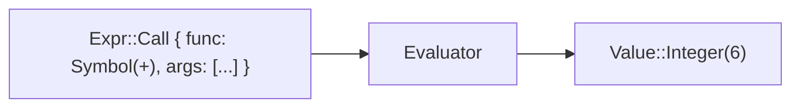
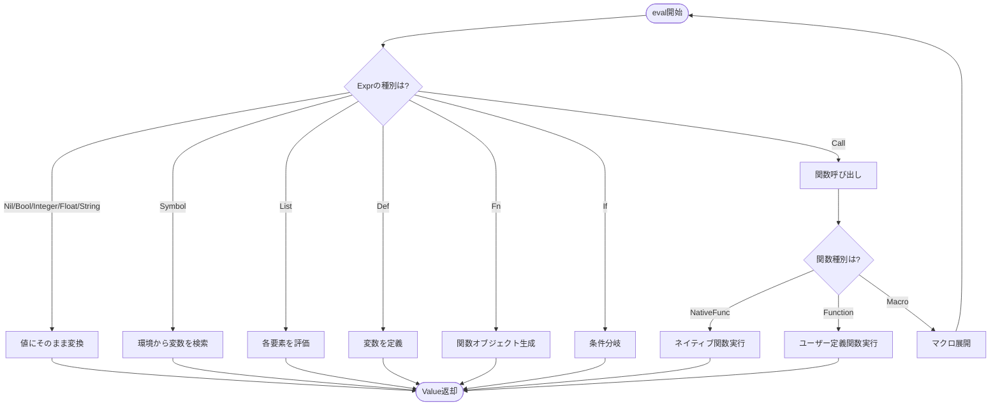
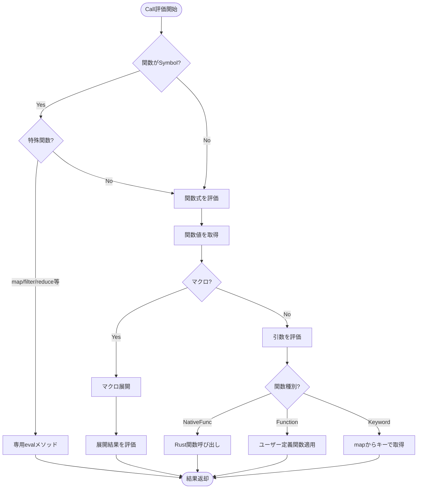

# 評価器 (Evaluator)

評価器（Evaluator）は、**抽象構文木（AST）を実行して値を得る**言語処理系の中核です。

📁 実装: `src/eval.rs`

## 処理の流れ



## Evaluator構造体

```rust
pub struct Evaluator {
    global_env: Arc<RwLock<Env>>,                   // グローバル環境
    defer_stack: Arc<RwLock<Vec<Vec<Expr>>>>,      // deferスタック
    modules: Arc<RwLock<HashMap<String, Arc<Module>>>>, // ロード済みモジュール
    current_module: Arc<RwLock<Option<String>>>,   // 現在評価中のモジュール
    loading_modules: Arc<RwLock<Vec<String>>>,     // 循環参照検出用
    call_stack: Arc<RwLock<Vec<String>>>,          // 関数呼び出しスタック
}
```

**設計のポイント:**
- `Arc<RwLock<T>>`で並行アクセスに対応
- `global_env`に組み込み関数と変数を保持
- `defer_stack`で遅延実行を管理（スコープごとにLIFO）
- `modules`でモジュールシステムをサポート

## 評価の基本構造



## メイン評価関数

```rust
fn eval_with_env(&self, expr: &Expr, env: Arc<RwLock<Env>>) -> Result<Value, String> {
    match expr {
        // リテラル → 直接Value化
        Expr::Nil => Ok(Value::Nil),
        Expr::Bool(b) => Ok(Value::Bool(*b)),
        Expr::Integer(n) => Ok(Value::Integer(*n)),
        Expr::Float(f) => Ok(Value::Float(*f)),
        Expr::String(s) => Ok(Value::String(s.clone())),
        Expr::Keyword(k) => Ok(Value::Keyword(k.clone())),

        // シンボル → 環境から検索
        Expr::Symbol(name) => {
            env.read().get(name).ok_or_else(|| {
                format!("Undefined variable: {}", name)
            })
        }

        // その他の式...
    }
}
```

## 特殊形式の評価

### 1. Def（変数定義）

```rust
Expr::Def(name, value) => {
    // 値を評価
    let val = self.eval_with_env(value, env.clone())?;

    // 名前衝突チェック（警告）
    if let Some(existing) = env.read().get(name) {
        match existing {
            Value::NativeFunc(_) => {
                eprintln!("Warning: Redefining builtin: {}", name);
            }
            _ => {
                eprintln!("Warning: Redefining: {}", name);
            }
        }
    }

    // 環境に設定
    env.write().set(name.clone(), val.clone());
    Ok(val)
}
```

**実行例:**
```lisp
(def x 42)
```
↓
```rust
env.set("x", Value::Integer(42))
→ Value::Integer(42)
```

### 2. Fn（関数生成）

```rust
Expr::Fn { params, body, is_variadic } => {
    Ok(Value::Function(Arc::new(Function {
        params: params.clone(),
        body: (**body).clone(),
        env: env.read().clone(),  // クロージャ（環境を保存）
        is_variadic: *is_variadic,
    })))
}
```

**クロージャの仕組み:**
```lisp
(def make-adder (fn [x] (fn [y] (+ x y))))
(def add5 (make-adder 5))
(add5 10)  ; => 15
```

内側の関数`(fn [y] ...)`が外側の`x`を捕捉します。

### 3. Let（ローカル変数）

```rust
Expr::Let { bindings, body } => {
    // 新しい環境を作成（親環境を持つ）
    let mut new_env = Env::with_parent(env.clone());

    // 束縛を評価して設定
    for (name, expr) in bindings {
        let value = self.eval_with_env(expr, Arc::new(RwLock::new(new_env.clone())))?;
        new_env.set(name.clone(), value);
    }

    // 新しい環境で本体を評価
    self.eval_with_env(body, Arc::new(RwLock::new(new_env)))
}
```

**実行例:**
```lisp
(let [x 10
      y 20]
  (+ x y))
```

スコープチェーン: `{ x: 10, y: 20 } → global_env`

### 4. If（条件分岐）

```rust
Expr::If { test, then, otherwise } => {
    let test_val = self.eval_with_env(test, env.clone())?;

    if test_val.is_truthy() {
        self.eval_with_env(then, env)
    } else if let Some(otherwise) = otherwise {
        self.eval_with_env(otherwise, env)
    } else {
        Ok(Value::Nil)
    }
}
```

**truthy/falsyの判定:**
- `false`と`nil`が**falsy**
- それ以外はすべて**truthy**（`0`も`""`もtruthy）

### 5. Do（複数式の実行）

```rust
Expr::Do(exprs) => {
    // deferスコープを作成
    self.defer_stack.write().push(Vec::new());

    let mut result = Value::Nil;
    for expr in exprs {
        result = self.eval_with_env(expr, env.clone())?;
    }

    // deferを実行（LIFO順）
    if let Some(defers) = self.defer_stack.write().pop() {
        for defer_expr in defers.iter().rev() {
            let _ = self.eval_with_env(defer_expr, env.clone());
        }
    }

    Ok(result)
}
```

**deferの仕組み:**
```lisp
(do
  (defer (print "cleanup"))
  (defer (print "close"))
  (print "main"))
```

実行順: `main` → `close` → `cleanup`（LIFO）

## 関数呼び出しの評価



### 関数呼び出しの実装

```rust
Expr::Call { func, args } => {
    // 特殊関数のチェック（map, filter, reduceなど）
    if let Expr::Symbol(name) = func.as_ref() {
        match name.as_str() {
            "map" => return self.eval_map(args, env),
            "filter" => return self.eval_filter(args, env),
            // ...
            _ => {}
        }
    }

    // 関数式を評価
    let func_val = self.eval_with_env(func, env.clone())?;

    // マクロの場合は展開してから評価
    if let Value::Macro(mac) = &func_val {
        let expanded = self.expand_macro(&mac, args, env.clone())?;
        return self.eval_with_env(&expanded, env);
    }

    // 引数を評価
    let arg_vals: Result<Vec<_>, _> = args
        .iter()
        .map(|e| self.eval_with_env(e, env.clone()))
        .collect();
    let arg_vals = arg_vals?;

    // 関数を適用
    match func_val {
        Value::NativeFunc(nf) => (nf.func)(&arg_vals),
        Value::Function(_) => self.apply_func(&func_val, arg_vals),
        Value::Keyword(key) => {
            // (:name map) => (get map :name)
            if let Value::Map(m) = &arg_vals[0] {
                m.get(&key).cloned().ok_or("Key not found")
            } else {
                Err("Keyword can only be called on maps")
            }
        }
        _ => Err("Not a function"),
    }
}
```

### ユーザー定義関数の適用

```rust
fn apply_func(&self, func: &Value, args: Vec<Value>) -> Result<Value, String> {
    if let Value::Function(f) = func {
        // 新しい環境を作成（関数定義時の環境を親とする）
        let mut func_env = Env::with_parent_env(f.env.clone());

        // 引数を束縛
        if f.is_variadic {
            // 可変引数: [x y & rest]
            let fixed_count = f.params.len() - 1;
            for (i, param) in f.params.iter().take(fixed_count).enumerate() {
                func_env.set(param.clone(), args[i].clone());
            }
            // 残りをリストとして束縛
            let rest: Vec<Value> = args.into_iter().skip(fixed_count).collect();
            func_env.set(f.params.last().unwrap().clone(), Value::List(rest));
        } else {
            // 通常の引数
            for (param, arg) in f.params.iter().zip(args.iter()) {
                func_env.set(param.clone(), arg.clone());
            }
        }

        // 関数本体を評価
        self.eval_with_env(&f.body, Arc::new(RwLock::new(func_env)))
    } else {
        Err("Not a function")
    }
}
```

**実行例:**
```lisp
(def add (fn [x y] (+ x y)))
(add 3 4)
```

1. `add`を環境から取得 → `Value::Function`
2. 引数`3`, `4`を評価 → `[Value::Integer(3), Value::Integer(4)]`
3. 新しい環境を作成: `{ x: 3, y: 4 } → (function定義時の環境)`
4. 本体`(+ x y)`を評価 → `Value::Integer(7)`

## パターンマッチの評価

```rust
Expr::Match { expr, arms } => {
    // 式を評価
    let value = self.eval_with_env(expr, env.clone())?;

    // 各armを順番に試す
    for arm in arms {
        let mut bindings = HashMap::new();

        // パターンマッチ
        if self.match_pattern(&arm.pattern, &value, &mut bindings)? {
            // ガード条件のチェック
            if let Some(guard) = &arm.guard {
                let mut guard_env = Env::with_parent(env.clone());
                for (name, val) in &bindings {
                    guard_env.set(name.clone(), val.clone());
                }
                let guard_val = self.eval_with_env(guard, Arc::new(RwLock::new(guard_env)))?;
                if !guard_val.is_truthy() {
                    continue;  // ガード失敗、次のarmへ
                }
            }

            // マッチ成功、本体を評価
            let mut match_env = Env::with_parent(env.clone());
            for (name, val) in bindings {
                match_env.set(name, val);
            }
            return self.eval_with_env(&arm.body, Arc::new(RwLock::new(match_env)));
        }
    }

    Err("No matching pattern")
}
```

### パターンマッチのアルゴリズム

```rust
fn match_pattern(
    &self,
    pattern: &Pattern,
    value: &Value,
    bindings: &mut HashMap<String, Value>,
) -> Result<bool, String> {
    match pattern {
        Pattern::Wildcard => Ok(true),  // _ は常にマッチ

        Pattern::Integer(n) => {
            Ok(matches!(value, Value::Integer(vn) if vn == n))
        }

        Pattern::Var(name) => {
            // 変数に値を束縛
            bindings.insert(name.clone(), value.clone());
            Ok(true)
        }

        Pattern::Vector(patterns) => {
            if let Value::Vector(values) = value {
                if patterns.len() != values.len() {
                    return Ok(false);
                }
                // 各要素を再帰的にマッチ
                for (pat, val) in patterns.iter().zip(values.iter()) {
                    if !self.match_pattern(pat, val, bindings)? {
                        return Ok(false);
                    }
                }
                Ok(true)
            } else {
                Ok(false)
            }
        }

        Pattern::List(patterns, rest) => {
            // [x y ...rest] パターン
            let values = match value {
                Value::List(v) | Value::Vector(v) => v,
                _ => return Ok(false),
            };

            // 固定部分をマッチ
            for (pat, val) in patterns.iter().zip(values.iter()) {
                if !self.match_pattern(pat, val, bindings)? {
                    return Ok(false);
                }
            }

            // 残りをrestに束縛
            if let Some(rest_pattern) = rest {
                let rest_values: Vec<Value> = values.iter().skip(patterns.len()).cloned().collect();
                self.match_pattern(rest_pattern, &Value::List(rest_values), bindings)?;
            }

            Ok(true)
        }

        Pattern::Or(patterns) => {
            // いずれかのパターンにマッチすればOK
            for pat in patterns {
                if self.match_pattern(pat, value, bindings)? {
                    return Ok(true);
                }
            }
            Ok(false)
        }

        // その他のパターン...
    }
}
```

**実行例:**
```lisp
(match [1 2 3 4 5]
  [x y ...rest] -> {:x x :y y :rest rest})
```

1. `[1 2 3 4 5]`を評価 → `Value::Vector([1, 2, 3, 4, 5])`
2. パターン`[x y ...rest]`とマッチ
   - `x` → `1`
   - `y` → `2`
   - `rest` → `[3, 4, 5]`
3. 本体`{:x x :y y :rest rest}`を評価
4. 結果: `{:x 1 :y 2 :rest [3 4 5]}`

## マクロの展開と評価

```rust
fn expand_macro(
    &self,
    mac: &Macro,
    args: &[Expr],
    env: Arc<RwLock<Env>>,
) -> Result<Expr, String> {
    // マクロ用の環境を作成
    let mut macro_env = Env::with_parent_env(mac.env.clone());

    // 引数を**評価せずに**束縛（重要！）
    if mac.is_variadic {
        let fixed_count = mac.params.len() - 1;
        for (i, param) in mac.params.iter().take(fixed_count).enumerate() {
            macro_env.set(param.clone(), expr_to_value(&args[i]));
        }
        // 残りをリストとして束縛
        let rest: Vec<Value> = args.iter().skip(fixed_count).map(expr_to_value).collect();
        macro_env.set(mac.params.last().unwrap().clone(), Value::List(rest));
    } else {
        for (param, arg) in mac.params.iter().zip(args.iter()) {
            macro_env.set(param.clone(), expr_to_value(arg));
        }
    }

    // マクロ本体を評価して展開結果（Expr）を得る
    let result = self.eval_with_env(&mac.body, Arc::new(RwLock::new(macro_env)))?;

    // ValueをExprに変換
    value_to_expr(&result)
}
```

**マクロと関数の違い:**

| | 関数 | マクロ |
|---|---|---|
| 引数の評価 | 評価する | 評価しない（Exprのまま受け取る） |
| 実行タイミング | 実行時 | 展開時（評価前） |
| 返り値 | Value | Expr（コード） |

**実行例:**
```lisp
(mac when [test & body]
  `(if ,test (do ,@body) nil))

(when (> x 10)
  (print "big")
  (print "really big"))
```

展開 ↓

```lisp
(if (> x 10)
  (do (print "big") (print "really big"))
  nil)
```

## エラーハンドリング

### Try式

```rust
Expr::Try(expr) => {
    self.defer_stack.write().push(Vec::new());

    let result = match self.eval_with_env(expr, env.clone()) {
        Ok(value) => {
            // 成功: {:ok value}
            let mut map = HashMap::new();
            map.insert("ok".to_string(), value);
            Ok(Value::Map(map))
        }
        Err(e) => {
            // 失敗: {:error e}
            let mut map = HashMap::new();
            map.insert("error".to_string(), Value::String(e));
            Ok(Value::Map(map))
        }
    };

    // deferを実行（エラーでも必ず実行）
    if let Some(defers) = self.defer_stack.write().pop() {
        for defer_expr in defers.iter().rev() {
            let _ = self.eval_with_env(defer_expr, env.clone());
        }
    }

    result
}
```

**実行例:**
```lisp
(try (/ 1 0))
; => {:error "Division by zero"}

(try (+ 1 2))
; => {:ok 3}
```

## 末尾再帰最適化

```rust
Expr::Loop { bindings, body } => {
    self.eval_loop(bindings, body, env)
}

Expr::Recur(args) => {
    // 引数を評価
    let values: Result<Vec<_>, _> = args
        .iter()
        .map(|e| self.eval_with_env(e, env.clone()))
        .collect();

    // 特別なエラーとして返す（Valueでは表現できない）
    Err(format!("__RECUR__:{}", values?.len()))
}

fn eval_loop(
    &self,
    bindings: &[(String, Expr)],
    body: &Expr,
    env: Arc<RwLock<Env>>,
) -> Result<Value, String> {
    // 初期値を評価
    let mut values = Vec::new();
    for (_, expr) in bindings {
        values.push(self.eval_with_env(expr, env.clone())?);
    }

    loop {
        // 新しい環境を作成
        let mut loop_env = Env::with_parent(env.clone());
        for ((name, _), value) in bindings.iter().zip(values.iter()) {
            loop_env.set(name.clone(), value.clone());
        }

        // 本体を評価
        match self.eval_with_env(body, Arc::new(RwLock::new(loop_env))) {
            Err(e) if e.starts_with("__RECUR__:") => {
                // recurが呼ばれた → 値を更新してループ継続
                // values = new_values（実際の実装ではもっと複雑）
            }
            result => return result,  // recurでなければ結果を返す
        }
    }
}
```

**実行例:**
```lisp
(loop [n 5
       acc 1]
  (if (<= n 0)
    acc
    (recur (- n 1) (* acc n))))
; => 120（5の階乗）
```

これはスタックを消費せずにループとして実行されます。

## 学びのポイント

1. **環境（Environment）の役割**
   - 変数名から値への写像
   - スコープチェーン（親環境へのリンク）
   - クロージャによる環境の保存

2. **遅延評価と正格評価**
   - 通常の関数は引数を先に評価（正格評価）
   - マクロは引数を評価しない（遅延評価）
   - 特殊形式（if, and, orなど）も制御された評価

3. **エラー伝搬**
   - `Result<Value, String>`でエラーを伝搬
   - `?`演算子でエラーを上位に委譲
   - tryで捕捉して値として扱う

4. **並行性への配慮**
   - `Arc<RwLock<T>>`で安全な共有
   - 複数スレッドからの評価に対応

5. **最適化**
   - 末尾再帰 → ループに変換（スタック消費なし）
   - defer → スコープごとに管理（効率的なクリーンアップ）

これらは一般的なインタプリタで共通の技法です。

## 次のステップ

評価器の土台となる環境管理については[環境とスコープ](./05-environment.md)で詳しく学びます。
