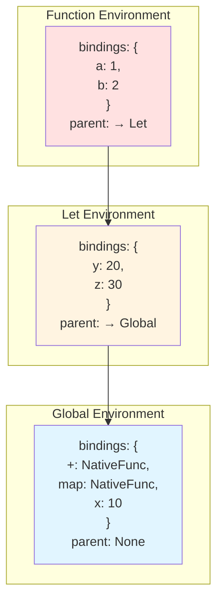
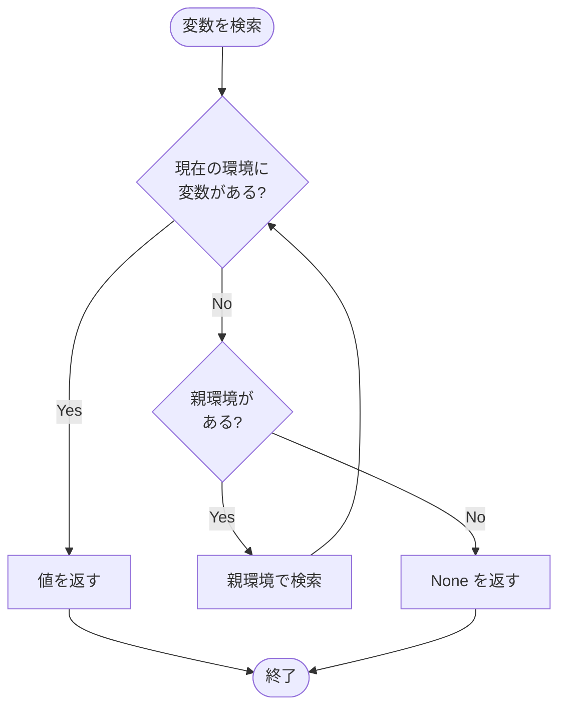
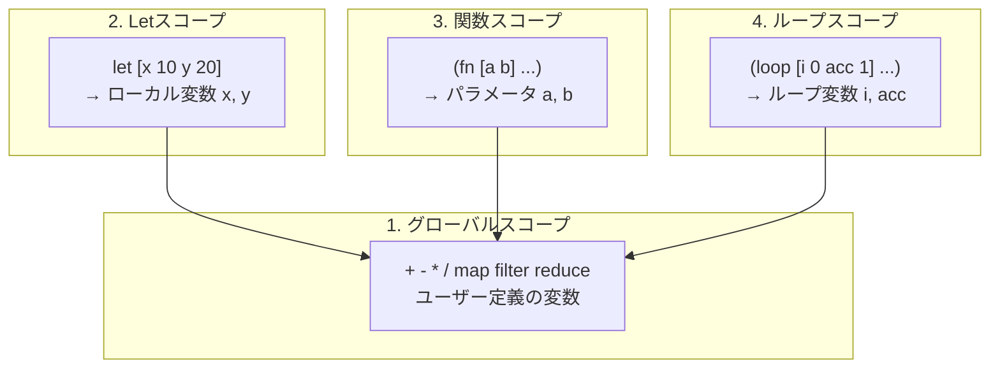
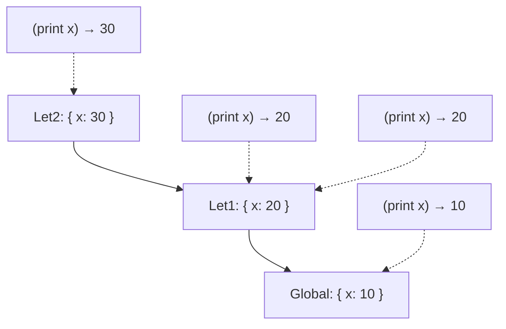
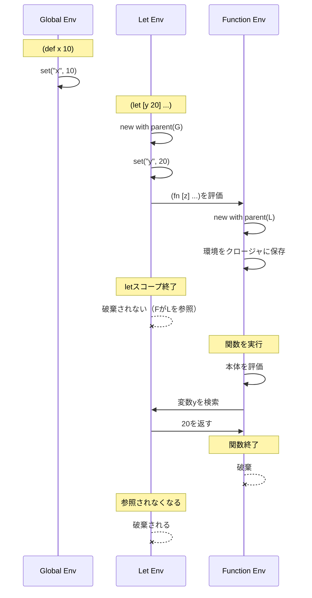

# 環境とスコープ (Environment and Scope)

環境（Environment）は、**変数名から値への写像**を管理するデータ構造です。スコープ管理とクロージャの実装に不可欠です。

📁 実装: `src/value.rs`（`Env`構造体）

## Env構造体

```rust
pub struct Env {
    bindings: HashMap<String, Value>,      // 変数の束縛
    parent: Option<Arc<RwLock<Env>>>,      // 親環境（スコープチェーン）
}
```

**設計のポイント:**
- `bindings`: 現在のスコープの変数を保持
- `parent`: 親環境へのリンク → **スコープチェーン**を形成
- `Arc<RwLock<Env>>`: スレッドセーフな共有と変更を実現

## スコープチェーンの構造



## 主要なメソッド

### 1. 環境の作成

```rust
impl Env {
    /// 新しい環境を作成（親なし）
    pub fn new() -> Self {
        Env {
            bindings: HashMap::new(),
            parent: None,
        }
    }

    /// 親環境を持つ新しい環境を作成
    pub fn with_parent(parent: Arc<RwLock<Env>>) -> Self {
        Env {
            bindings: HashMap::new(),
            parent: Some(parent),
        }
    }
}
```

**使用例:**
```rust
// グローバル環境
let global_env = Arc::new(RwLock::new(Env::new()));

// ローカル環境（グローバルを親とする）
let local_env = Env::with_parent(global_env.clone());
```

### 2. 変数の検索

```rust
pub fn get(&self, name: &str) -> Option<Value> {
    self.bindings
        .get(name)
        .cloned()
        .or_else(|| self.parent.as_ref().and_then(|p| p.read().get(name)))
}
```

**検索の流れ:**
1. 現在の環境の`bindings`から検索
2. 見つからなければ親環境で再帰的に検索
3. 見つかれば値を返す、見つからなければ`None`



**実行例:**
```rust
// グローバル環境に x = 10 を設定
global_env.write().set("x".to_string(), Value::Integer(10));

// ローカル環境に y = 20 を設定
local_env.set("y".to_string(), Value::Integer(20));

// 検索
local_env.get("y");  // => Some(Value::Integer(20))（自分の環境）
local_env.get("x");  // => Some(Value::Integer(10))（親環境）
local_env.get("z");  // => None（見つからない）
```

### 3. 変数の設定

```rust
pub fn set(&mut self, name: String, value: Value) {
    self.bindings.insert(name, value);
}
```

**重要な特性:**
- 常に**現在の環境**に設定
- 親環境の変数を上書きしない → シャドーイング

**シャドーイングの例:**
```rust
global_env.write().set("x".to_string(), Value::Integer(10));

let mut local_env = Env::with_parent(global_env.clone());
local_env.set("x".to_string(), Value::Integer(20));

local_env.get("x");       // => Some(Value::Integer(20))（ローカル）
global_env.read().get("x"); // => Some(Value::Integer(10))（グローバルは変わらず）
```

## レキシカルスコープ

Qiは**レキシカルスコープ（静的スコープ）**を採用しています：

```lisp
(def x 10)

(def make-adder (fn [y]
  (fn [z] (+ x y z))))

(def add-with-5 (make-adder 5))

(def x 100)  ; グローバルのxを再定義

(add-with-5 3)  ; => 18（10 + 5 + 3）
```

**なぜ18？**
- 内側の関数`(fn [z] ...)`は、**定義時**の環境を保存（クロージャ）
- 定義時の`x`は`10`
- 呼び出し時の`x`（`100`）は使われない

## クロージャの実装

関数定義時に環境を保存することで、クロージャを実現します：

```rust
pub struct Function {
    pub params: Vec<String>,
    pub body: Expr,
    pub env: Env,              // 定義時の環境を保存
    pub is_variadic: bool,
}
```

**関数の評価:**

```rust
// Fn式の評価（評価器内）
Expr::Fn { params, body, is_variadic } => {
    Ok(Value::Function(Arc::new(Function {
        params: params.clone(),
        body: (**body).clone(),
        env: env.read().clone(),  // 現在の環境を保存
        is_variadic: *is_variadic,
    })))
}
```

**関数の適用:**

```rust
fn apply_func(&self, func: &Value, args: Vec<Value>) -> Result<Value, String> {
    if let Value::Function(f) = func {
        // 定義時の環境を親とする新しい環境を作成
        let mut func_env = Env::with_parent_env(f.env.clone());

        // 引数を束縛
        for (param, arg) in f.params.iter().zip(args.iter()) {
            func_env.set(param.clone(), arg.clone());
        }

        // 関数本体を評価
        self.eval_with_env(&f.body, Arc::new(RwLock::new(func_env)))
    } else {
        Err("Not a function")
    }
}
```

## スコープの種類



### 1. グローバルスコープ

```rust
let global_env = Env::new();
global_env.set("x".to_string(), Value::Integer(42));
```

**特徴:**
- 親環境なし
- 組み込み関数がここに登録される
- プログラム全体で共有

### 2. Letスコープ

```rust
Expr::Let { bindings, body } => {
    let mut new_env = Env::with_parent(env.clone());

    for (name, expr) in bindings {
        let value = self.eval_with_env(expr, Arc::new(RwLock::new(new_env.clone())))?;
        new_env.set(name.clone(), value);
    }

    self.eval_with_env(body, Arc::new(RwLock::new(new_env)))
}
```

**実行例:**
```lisp
(let [x 10
      y 20]
  (+ x y))
```

スコープチェーン: `{ x: 10, y: 20 } → global`

### 3. 関数スコープ

```rust
let mut func_env = Env::with_parent_env(f.env.clone());

for (param, arg) in f.params.iter().zip(args.iter()) {
    func_env.set(param.clone(), arg.clone());
}
```

**実行例:**
```lisp
(def add (fn [x y] (+ x y)))
(add 3 4)
```

スコープチェーン: `{ x: 3, y: 4 } → (定義時の環境) → global`

### 4. ループスコープ

```rust
fn eval_loop(
    &self,
    bindings: &[(String, Expr)],
    body: &Expr,
    env: Arc<RwLock<Env>>,
) -> Result<Value, String> {
    let mut values = Vec::new();
    for (_, expr) in bindings {
        values.push(self.eval_with_env(expr, env.clone())?);
    }

    loop {
        let mut loop_env = Env::with_parent(env.clone());
        for ((name, _), value) in bindings.iter().zip(values.iter()) {
            loop_env.set(name.clone(), value.clone());
        }

        // ループ本体を評価...
    }
}
```

**実行例:**
```lisp
(loop [i 0
       acc 1]
  (if (>= i 5)
    acc
    (recur (+ i 1) (* acc (+ i 1)))))
```

各イテレーションで新しい環境を作成：
- イテレーション1: `{ i: 0, acc: 1 } → global`
- イテレーション2: `{ i: 1, acc: 1 } → global`
- イテレーション3: `{ i: 2, acc: 2 } → global`
- ...

## 並行性とスレッドセーフ

```rust
pub struct Evaluator {
    global_env: Arc<RwLock<Env>>,
    // ...
}
```

**`Arc<RwLock<Env>>`の役割:**

1. **`Arc` (Atomic Reference Counting)**
   - 複数の所有者で環境を共有
   - スレッド間で安全に共有可能

2. **`RwLock` (Read-Write Lock)**
   - 複数の読み取りまたは1つの書き込み
   - データ競合を防ぐ

**使用例:**
```rust
// 読み取り
let value = env.read().get("x");

// 書き込み
env.write().set("x".to_string(), Value::Integer(42));
```

## シャドーイングとスコープの可視性

```lisp
(def x 10)

(let [x 20]
  (print x)          ; => 20（ローカルのx）
  (let [x 30]
    (print x))       ; => 30（さらに内側のx）
  (print x))         ; => 20（1つ外のx）

(print x)            ; => 10（グローバルのx）
```

**スコープチェーンの遷移:**



## 環境のライフタイム



**重要なポイント:**
- 環境は`Arc`で管理されているため、参照カウントが0になるまで破棄されない
- クロージャが環境を保持している限り、親環境も生き続ける

## 環境とモジュールシステム

```rust
pub fn bindings(&self) -> impl Iterator<Item = (&String, &Value)> {
    self.bindings.iter()
}
```

モジュールシステムでは、エクスポートされたシンボルを収集するためにバインディングを反復します：

```rust
Expr::Export(symbols) => {
    let mut exports = HashMap::new();
    for symbol in symbols {
        if let Some(value) = env.read().get(symbol) {
            exports.insert(symbol.clone(), value);
        }
    }
    // モジュールに登録...
}
```

## 学びのポイント

1. **スコープチェーン**
   - 環境を連結リストとして実装
   - 変数検索は現在→親→祖父...と辿る

2. **レキシカルスコープ**
   - 変数の可視性は**定義位置**で決まる
   - 呼び出し位置ではない（動的スコープとの違い）

3. **クロージャ**
   - 関数が定義時の環境を保存
   - 自由変数を捕捉（キャプチャ）

4. **シャドーイング**
   - 内側のスコープが外側の変数を隠す
   - 外側の変数は変更されない

5. **並行性**
   - `Arc`で共有、`RwLock`で排他制御
   - スレッドセーフな環境管理

これらは多くのプログラミング言語で共通の概念です。

## 次のステップ

組み込み関数の登録と実装については[ビルトイン関数](./06-builtins.md)で学びます。
