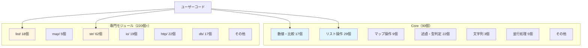
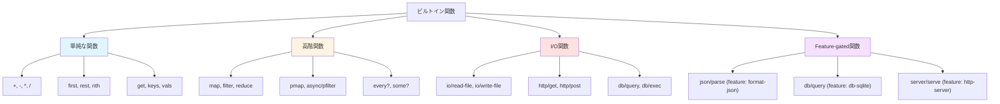
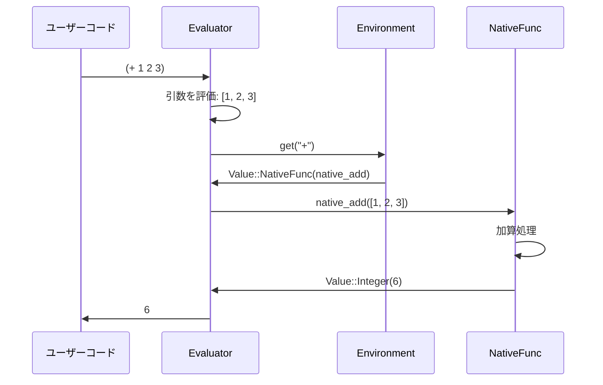

# ビルトイン関数 (Built-in Functions)

ビルトイン関数は、**Rustで実装されたネイティブ関数**です。言語の基本機能を提供します。

📁 実装: `src/builtins/mod.rs` + 各モジュール

## 全体構造

Qiは**2層モジュール設計**を採用しています：



### Core（グローバル名前空間）

```lisp
(+ 1 2)                    ; Core関数は直接使える
(map inc [1 2 3])
(filter even? [1 2 3 4])
```

### 専門モジュール（`module/function`形式）

```lisp
(list/frequencies [1 2 2 3 3 3])      ; リスト操作
(str/upper "hello")                    ; 文字列操作
(io/read-file "data.txt")              ; ファイルI/O
(http/get "https://api.example.com")   ; HTTP通信
```

## NativeFunc構造体

```rust
pub struct NativeFunc {
    pub name: String,
    pub func: fn(&[Value]) -> Result<Value, String>,
}
```

**特徴:**
- `func`: Rust関数ポインタ
- 引数: `&[Value]`（評価済みの値の配列）
- 戻り値: `Result<Value, String>`（成功/エラー）

## 組み込み関数の登録

### register_nativeマクロ

```rust
macro_rules! register_native {
    ($env:expr, $($name:expr => $func:expr),* $(,)?) => {
        $(
            $env.set(
                $name.to_string(),
                Value::NativeFunc(NativeFunc {
                    name: $name.to_string(),
                    func: $func,
                }),
            );
        )*
    };
}
```

### register_all関数

```rust
pub fn register_all(env: &Arc<RwLock<Env>>) {
    register_native!(env.write(),
        // Core: 数値・比較演算
        "+" => core_numeric::native_add,
        "-" => core_numeric::native_sub,
        "*" => core_numeric::native_mul,
        "/" => core_numeric::native_div,
        "=" => core_numeric::native_eq,

        // Core: リスト操作
        "first" => core_collections::native_first,
        "rest" => core_collections::native_rest,
        "nth" => core_collections::native_nth,
        "map" => hof::native_map,
        "filter" => hof::native_filter,

        // 専門モジュール: str
        "str/upper" => string::native_upper,
        "str/lower" => string::native_lower,
        "str/trim" => string::native_trim,

        // 専門モジュール: io
        "io/read-file" => io::native_read_file,
        "io/write-file" => io::native_write_file,

        // ...その他300個以上
    );
}
```

**実行タイミング:**
`Evaluator::new()`の中で呼ばれ、グローバル環境に登録されます。

## ビルトイン関数の実装例

### 1. 単純な関数（Evaluator不要）

```rust
// src/builtins/core_numeric.rs

/// 加算: (+ 1 2 3) => 6
pub fn native_add(args: &[Value]) -> Result<Value, String> {
    if args.is_empty() {
        return Ok(Value::Integer(0));
    }

    let mut int_sum = 0i64;
    let mut float_sum = 0.0f64;
    let mut has_float = false;

    for arg in args {
        match arg {
            Value::Integer(n) => {
                int_sum += n;
            }
            Value::Float(f) => {
                has_float = true;
                float_sum += f;
            }
            _ => return Err(format!("+ expects numbers, got {}", arg.type_name())),
        }
    }

    if has_float {
        Ok(Value::Float(int_sum as f64 + float_sum))
    } else {
        Ok(Value::Integer(int_sum))
    }
}
```

**ポイント:**
- 引数はすべて評価済み
- `&[Value]`を受け取り、`Result<Value, String>`を返す
- 整数と浮動小数点数の両方をサポート

### 2. 高階関数（Evaluator必要）

```rust
// src/builtins/hof.rs

/// map: (map inc [1 2 3]) => [2 3 4]
pub fn native_map(args: &[Value], evaluator: &Evaluator) -> Result<Value, String> {
    if args.len() != 2 {
        return Err("map requires exactly 2 arguments: (map fn coll)".to_string());
    }

    let func = &args[0];
    let coll = &args[1];

    match coll {
        Value::List(items) | Value::Vector(items) => {
            let mut results = Vec::new();
            for item in items {
                // 関数を各要素に適用
                let result = evaluator.apply_function(func, &[item.clone()])?;
                results.push(result);
            }
            Ok(Value::Vector(results))
        }
        _ => Err("map expects a collection".to_string()),
    }
}
```

**ポイント:**
- `&Evaluator`を追加で受け取る
- `evaluator.apply_function()`で関数を適用
- 引数として受け取った関数を各要素に適用

### 3. I/O関数

```rust
// src/builtins/io.rs

/// ファイル読み込み: (io/read-file "data.txt")
pub fn native_read_file(args: &[Value]) -> Result<Value, String> {
    if args.len() != 1 {
        return Err("io/read-file requires exactly 1 argument".to_string());
    }

    match &args[0] {
        Value::String(path) => {
            let content = std::fs::read_to_string(path)
                .map_err(|e| format!("Failed to read file: {}", e))?;
            Ok(Value::String(content))
        }
        _ => Err("io/read-file expects a string path".to_string()),
    }
}
```

**ポイント:**
- 標準ライブラリ（`std::fs`）を使用
- エラーを`Result`で返す
- `map_err`でRustのエラーをqi-langのエラーに変換

## 関数の分類



### 1. 単純な関数（Evaluator不要）

引数を処理して値を返すだけ：
- 数値演算: `+, -, *, /, %, abs, min, max`
- リスト操作: `first, rest, last, nth, len, cons, conj`
- マップ操作: `get, keys, vals, assoc, dissoc`
- 述語: `nil?, list?, map?, string?, even?, odd?`
- 型変換: `to-int, to-float, to-string`

### 2. 高階関数（Evaluator必要）

関数を引数に取り、評価器が必要：
- `map, filter, reduce`
- `pmap, async/pfilter, async/preduce`（並列版）
- `every?, some?, find`
- `take-while, drop-while`
- `list/partition, list/group-by`
- `list/sort-by, list/count-by, list/max-by, list/min-by`

### 3. I/O関数

外部リソースにアクセス：
- ファイル: `io/read-file, io/write-file, io/list-dir`
- HTTP: `http/get, http/post, http/request`
- データベース: `db/query, db/exec, db/connect`

### 4. Feature-gated関数

オプション機能（条件コンパイル）：
- JSON: `json/parse, json/stringify` (`feature = "format-json"`)
- YAML: `yaml/parse, yaml/stringify` (`feature = "format-yaml"`)
- SQLite: `db/query, db/exec` (`feature = "db-sqlite"`)
- HTTPサーバー: `server/serve` (`feature = "http-server"`)

## ビルトイン関数の呼び出しフロー



**ステップ:**
1. ユーザーコード: `(+ 1 2 3)`
2. 評価器: 引数を評価 → `[Value::Integer(1), Value::Integer(2), Value::Integer(3)]`
3. 環境: `"+"`を検索 → `Value::NativeFunc(native_add)`
4. ネイティブ関数: `native_add([1, 2, 3])` → `Value::Integer(6)`
5. 結果を返す

## ビルトイン関数の実装パターン

### パターン1: 引数チェック

```rust
pub fn native_nth(args: &[Value]) -> Result<Value, String> {
    if args.len() != 2 {
        return Err("nth requires exactly 2 arguments".to_string());
    }

    let coll = &args[0];
    let index = &args[1];

    // 処理...
}
```

### パターン2: 型チェックとパターンマッチ

```rust
pub fn native_first(args: &[Value]) -> Result<Value, String> {
    if args.len() != 1 {
        return Err("first requires exactly 1 argument".to_string());
    }

    match &args[0] {
        Value::List(items) | Value::Vector(items) => {
            Ok(items.first().cloned().unwrap_or(Value::Nil))
        }
        Value::Nil => Ok(Value::Nil),
        _ => Err("first expects a collection".to_string()),
    }
}
```

### パターン3: 可変長引数

```rust
pub fn native_add(args: &[Value]) -> Result<Value, String> {
    if args.is_empty() {
        return Ok(Value::Integer(0));  // 引数なし → 0
    }

    let mut sum = 0;
    for arg in args {
        match arg {
            Value::Integer(n) => sum += n,
            _ => return Err("+ expects numbers".to_string()),
        }
    }

    Ok(Value::Integer(sum))
}
```

### パターン4: 高階関数の実装

```rust
pub fn native_filter(args: &[Value], evaluator: &Evaluator) -> Result<Value, String> {
    if args.len() != 2 {
        return Err("filter requires exactly 2 arguments".to_string());
    }

    let predicate = &args[0];
    let coll = &args[1];

    match coll {
        Value::List(items) | Value::Vector(items) => {
            let mut results = Vec::new();
            for item in items {
                // 述語関数を適用
                let result = evaluator.apply_function(predicate, &[item.clone()])?;

                // truthyなら結果に追加
                if result.is_truthy() {
                    results.push(item.clone());
                }
            }
            Ok(Value::Vector(results))
        }
        _ => Err("filter expects a collection".to_string()),
    }
}
```

## 並行処理のビルトイン

### チャネル

```rust
// src/builtins/core_concurrency.rs

/// チャネル作成: (chan)
pub fn native_chan(args: &[Value]) -> Result<Value, String> {
    let capacity = if args.is_empty() {
        0  // バッファなし
    } else {
        match &args[0] {
            Value::Integer(n) => *n as usize,
            _ => return Err("chan expects an integer capacity".to_string()),
        }
    };

    let (tx, rx) = if capacity == 0 {
        crossbeam::channel::unbounded()
    } else {
        crossbeam::channel::bounded(capacity)
    };

    Ok(Value::Channel(Arc::new(RwLock::new((tx, rx)))))
}

/// 送信: (send! ch value)
pub fn native_send(args: &[Value]) -> Result<Value, String> {
    if args.len() != 2 {
        return Err("send! requires 2 arguments".to_string());
    }

    match &args[0] {
        Value::Channel(ch) => {
            let (tx, _) = &*ch.read();
            tx.send(args[1].clone())
                .map_err(|e| format!("send! failed: {}", e))?;
            Ok(Value::Nil)
        }
        _ => Err("send! expects a channel".to_string()),
    }
}
```

### Goroutine風の非同期実行

```rust
/// go: (go (fn [] (expensive-computation)))
pub fn native_go(args: &[Value], evaluator: &Evaluator) -> Result<Value, String> {
    if args.len() != 1 {
        return Err("go requires exactly 1 argument (a function)".to_string());
    }

    let func = args[0].clone();
    let evaluator = evaluator.clone();

    let handle = std::thread::spawn(move || {
        evaluator.apply_function(&func, &[])
    });

    Ok(Value::Handle(Arc::new(RwLock::new(Some(handle)))))
}
```

## エラーハンドリング

### パターン1: 早期リターン

```rust
pub fn native_div(args: &[Value]) -> Result<Value, String> {
    if args.len() != 2 {
        return Err("/ requires exactly 2 arguments".to_string());
    }

    match (&args[0], &args[1]) {
        (Value::Integer(a), Value::Integer(b)) => {
            if *b == 0 {
                return Err("Division by zero".to_string());
            }
            Ok(Value::Integer(a / b))
        }
        _ => Err("/ expects numbers".to_string()),
    }
}
```

### パターン2: map_errでエラー変換

```rust
pub fn native_read_file(args: &[Value]) -> Result<Value, String> {
    match &args[0] {
        Value::String(path) => {
            let content = std::fs::read_to_string(path)
                .map_err(|e| format!("Failed to read file '{}': {}", path, e))?;
            Ok(Value::String(content))
        }
        _ => Err("io/read-file expects a string path".to_string()),
    }
}
```

## モジュールの構成

```
src/builtins/
├── mod.rs                  - 全関数の登録
├── core_numeric.rs         - 数値演算
├── core_collections.rs     - リスト/マップ操作
├── core_predicates.rs      - 述語・型判定
├── core_string.rs          - 基本文字列操作
├── core_util.rs            - 型変換・日時
├── core_io_logic.rs        - I/O・論理演算
├── core_functions.rs       - 基本高階関数
├── core_state_meta.rs      - 状態管理・メタプログラミング
├── core_concurrency.rs     - 並行処理（基本）
├── hof.rs                  - 高階関数（高度）
├── list.rs                 - リスト操作（高度）
├── map.rs                  - マップ操作（高度）
├── string.rs               - 文字列操作（62個）
├── io.rs                   - ファイルI/O
├── http.rs                 - HTTP通信
├── server.rs               - HTTPサーバー
├── db.rs                   - データベース（統一API）
├── sqlite.rs               - SQLite専用機能
├── math.rs                 - 数学関数
├── time.rs                 - 日時処理
├── concurrency.rs          - 並行処理（高度）
├── stream.rs               - ストリーム処理
├── json.rs                 - JSON処理
├── yaml.rs                 - YAML処理
├── csv.rs                  - CSV処理
├── markdown.rs             - Markdown処理
├── set.rs                  - 集合演算
├── stats.rs                - 統計関数
├── path.rs                 - パス操作
├── env.rs                  - 環境変数
├── log.rs                  - 構造化ログ
├── test.rs                 - テスト機能
├── profile.rs              - プロファイラ
├── ds.rs                   - データ構造（Queue, Stack）
├── flow.rs                 - フロー制御
├── util.rs                 - ユーティリティ
├── args.rs                 - コマンドライン引数
├── temp.rs                 - 一時ファイル
├── cmd.rs                  - コマンド実行
└── zip.rs                  - ZIP圧縮
```

## Feature Flags

Cargo.tomlで機能を選択的にコンパイル：

```toml
[features]
default = ["std", "string-encoding", "string-crypto"]

std = [
    "std-math",
    "std-time",
    "std-set",
    "std-stats",
]

http-client = ["dep:reqwest"]
http-server = ["dep:axum", "dep:tower-http"]
db-sqlite = ["dep:rusqlite"]
format-json = ["dep:serde_json"]
format-yaml = ["dep:serde_yaml"]
format-markdown = ["dep:pulldown-cmark"]
```

**使用例:**
```rust
#[cfg(feature = "format-json")]
pub mod json;

#[cfg(feature = "format-json")]
register_native!(env.write(),
    "json/parse" => json::native_parse,
    "json/stringify" => json::native_stringify,
);
```

## 学びのポイント

1. **関数ポインタの活用**
   - `fn(&[Value]) -> Result<Value, String>`で統一
   - マクロで簡単に登録

2. **高階関数の実装**
   - Evaluatorを引数に取る
   - `apply_function()`で関数適用

3. **エラー処理**
   - `Result`型で明示的にエラーを扱う
   - `map_err`でRustエラーを変換

4. **Feature Flags**
   - 条件コンパイルで必要な機能だけをビルド
   - バイナリサイズの削減

5. **並行処理**
   - `Arc<RwLock<T>>`でスレッドセーフ
   - チャネルとgoroutineでCSP（Communicating Sequential Processes）

これらはRustでの言語実装の一般的な技法です。

## まとめ

ビルトイン関数の実装により：
- **言語の基本機能**を提供（演算、リスト、マップ操作等）
- **高度な機能**を提供（HTTP、DB、並行処理等）
- **拡張性**を確保（新しい関数を簡単に追加可能）
- **パフォーマンス**を実現（Rustのネイティブコード）

これで言語処理系の全体像を学びました！
